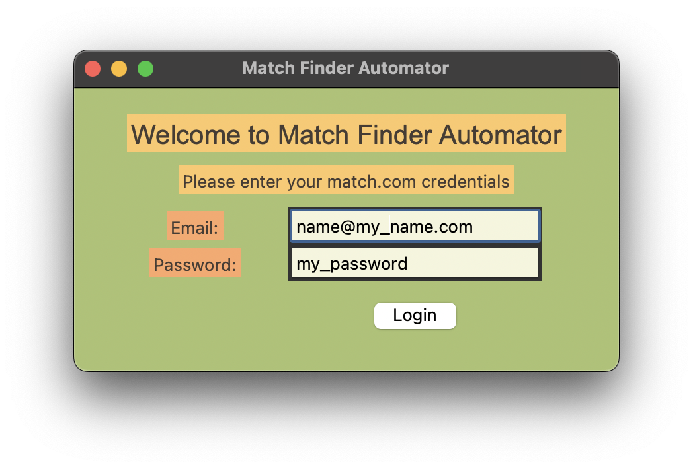

# Match Finder Automator

This code is a tkinter GUI application that automates the process of logging into match.com and finding matches. It 
first creates the main window with a welcome message and instructions, then adds labels and entry fields for email 
and password. Finally, it defines a login() function which takes the email and password entered by the user and 
logs in to match.com. It then clicks on the Shuffle option to find matches. The code uses webdriver and selenium to 
automate the match finding process.

## Getting Started

These instructions will get you a copy of the project up and running on your local machine for development and testing purposes. 

### Prerequisites

You need to have the following software installed in your system:

* Python 3.x
* tkinter module 
* selenium module 
* webdriver

### Installing

1. Download and install [Python 3.x](https://www.python.org/downloads/)
2. Run the following command to install the necessary packages:
```
pip install selenium
```
3. Next, download the [webdriver](https://chromedriver.chromium.org/downloads) most suitable for your system
4. Extract the webdriver and move to any directory of your choice

### Running the Code

1. To run the code, simply open the `main.py` file in any text editor
2. Edit the file with the necessary webdriver path, email and password
3. Run the file and the application will be launched
4. Once the application is launched, enter the email and password and click the login button
5. This will initiate the match finding process and you will be presented with potential matches

